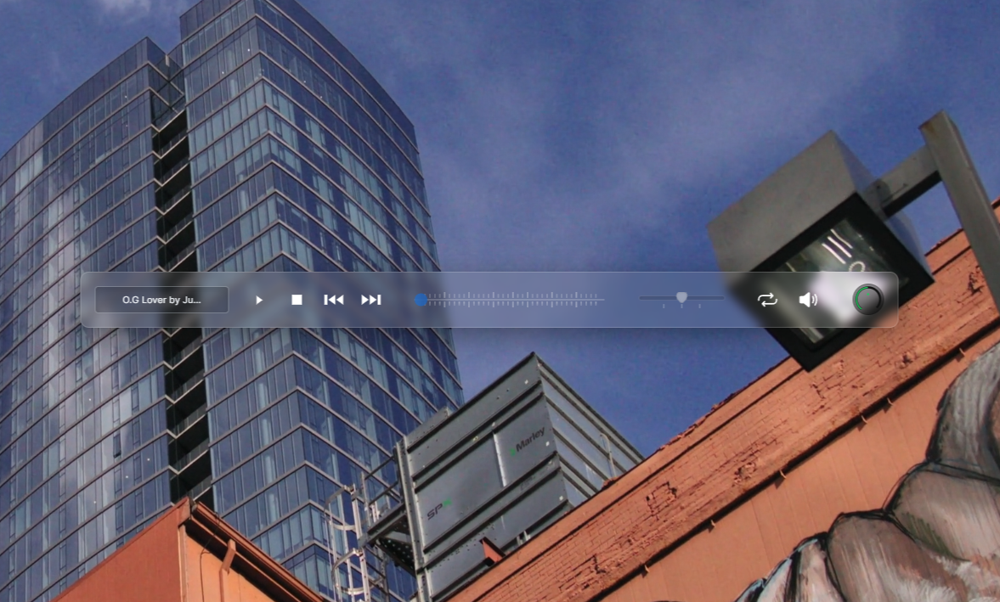

# React Audio Player



## Table of Contents

- [About](#about)
- [Live Demo](#live-demo)
- [Features](#features)
- [Technologies Used](#technologies-used)
- [Setup](#setup)
- [License](#license)

## About

This audio player web app is built to provide users with easy playback controls and a clear, responsive interface. It displays playlists, allowing users to select and play tracks seamlessly. The app includes a customized: volume knob, rate bar and seek bar.

Live Demo: "Coming soon"

## Features

- **Play, Pause, and Skip Controls**: Easily control playback of audio files.
- **Loop & Mute Toggles**: Options to loop tracks and mute audio.
- **SeekBar with Customized Display**: A visual control for navigating tracks.
- **RateBar**: Allows tempo and pitch manipulation.
- **Volume Control**: Adjust volume via a customized "Knob" component.
- **Background Video**: Enhances user experience with a dynamic background.

## Technologies Used

- **React**: JavaScript library for building user interfaces.
- **Vite**: Fast build tool and development server.
- **ESLint & Prettier**: Code linting and formatting tools for a consistent codebase.
- **Sass**: CSS preprocessor for styling.
- **React-Howler**: Audio library for managing audio playback.
- **PropTypes**: Library for type-checking React component props.

## Setup

1. **Clone the repository**:

  ```bash
  git clone https://github.com/yaneczq/react-audio-player.git
  ```

2. Navigate to the project directory:
   
  ```
  $ cd react-audio-player
  ```

3. Install dependencies:
   
  ```
  $ npm install
  ```

4. Start the development server:
  ```
  $ npm run dev
  ```

## License

This project is licensed under the MIT License. See the [LICENSE](./LICENSE) file for details.
